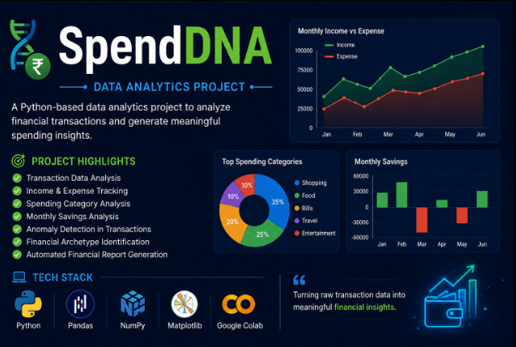
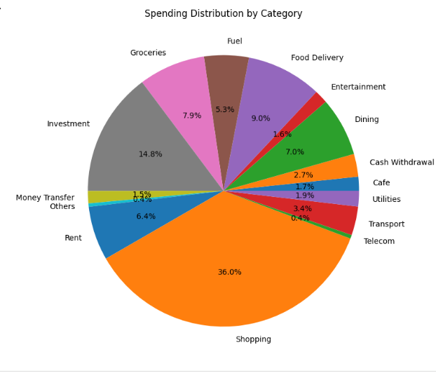
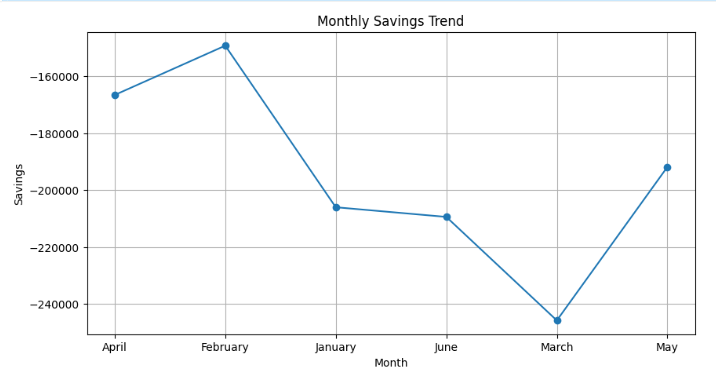
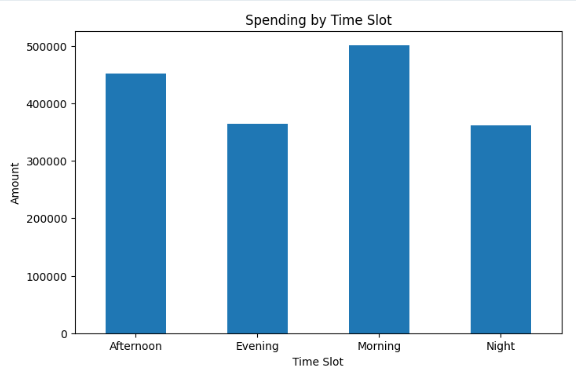
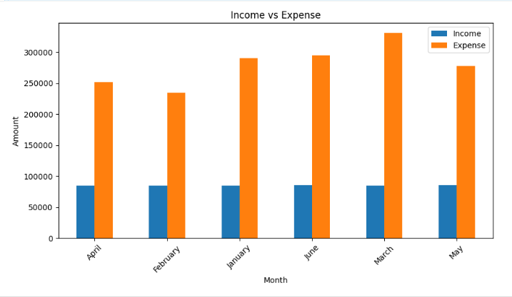

# SpendDNA-Data-Analytics-Project
A Python-based data analytics project for financial transaction analysis and spending insights.

**💰 SpendDNA**

A Python-based data analytics project that analyzes financial transaction data to generate meaningful spending insights.

**Features**
Transaction Analysis
Income & Expense Tracking
Spending Category Analysis
Monthly Savings Analysis
Anomaly Detection
Financial Archetype Identification
Automated Report Generation

**Tech Stack**
Python
Pandas
NumPy
Matplotlib
Google collab

# 📷 Project Preview

## Project Cover

## Final Report

## Spending Categories Pie Chart

## Transaction Amount Distribution

## Monthly Saving Trends 

## Spending Time Slot

## Income vs Expense

